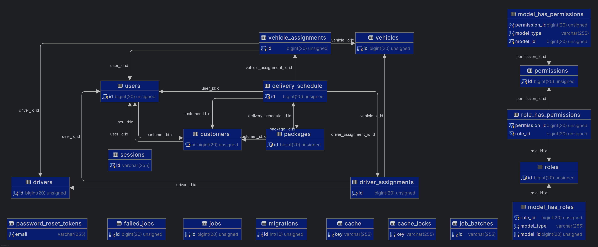

## PlusMove

### Technical Assessment for PlusNarrative

This is a Laravel app with styling from Material Design for Bootstrap.



### **Real-Time Package Delivery Management System**
#### **Frontend Interface**
- **User Profiles**
    - View/Edit profile information
    - Package preferences
- **Multi-language Support**
    - Language selection dropdown
    - Auto-detection based on location
- **Package History**
    - Delivered package details
    - Timeline view for active packages

#### **API Backend**
- **Rate Limiting**
    - Per-user API request limits
    - Dynamic adjustment for high traffic
- **Error Handling**
    - Consistent error message structure
    - Log storage for debugging
- **Versioning**
    - Backward-compatible API updates
    - Deprecated API version notifications

#### **User Roles and Permissions**
- **Role Customization**
    - Create/edit/delete roles
    - Assign permissions by role
- **Permission Audit Logs**
    - Track changes to role assignments
    - Logs viewable by administrators
- **User Activity Tracking**
    - Monitor login/logout times
    - Track API requests by user

#### **Real-Time Monitoring**
- **Package Status**
    - Real-time updates via SMS/email/etc
- **Incident Reporting**
    - Driver accident reports
    - System notifications for delays
- **Customer Feedback Loop**
    - Post-delivery surveys
    - Analytics on feedback trends


### Setup

1. Clone this repository:

```
git clone https://github.com/wni5378/plusmove.git
cd plusmove
```

2. Create the `.env` file:

```
cp .env.example .env
php artisan key:generate
```

3. Install Composer and NPM packages:

```
composer install
npm install
npm run build
```

4. **IMPORTANT**: START ARTISAN SERVER BEFORE MIGRATION:

```
php artisan serve
```

5. Migrate and seed database (if using MySQL or MariaDB, modify the database values in `.env`):

```
php artisan migrate --seed
```

6. Start Vite:

```
npm run dev
```

7. Login with any of the following users:

#### Admin User

Email Address: `admin@gmail.com`

Password: `12345678`

#### Manager User

Email Address: `manager@gmail.com`

Password: `12345678`

#### Manager User

Email Address: `customer@gmail.com`

Password: `12345678`

#### Scheduling User

Email Address: `scheduling@gmail.com`

Password: `12345678`

#### End User

Email Address: `user@gmail.com`

Password: `12345678`

